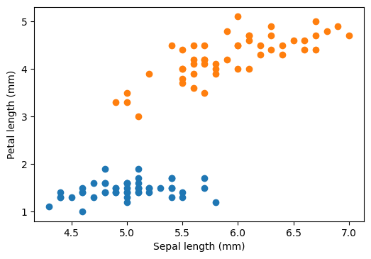

Support Vector Machine (SVM) is a technique used for binary classification. Let
us consider a categorical data:
```python
from sklearn import datasets
import matplotlib.pyplot as plt

%matplotlib inline
plt.rcParams["figure.dpi"] = 100
plt.rcParams["figure.facecolor"] = "white"

iris = datasets.load_iris()
data = iris.data

# data[:4, :]
# iris.feature_names
# iris.target

sepal_length = data[:, 0]
petal_length = data[:, 2]

# here we will pick two categories, the dataset has three differnt target values
plt.scatter(sepal_length[iris.target == 0], petal_length[iris.target == 0])
plt.scatter(sepal_length[iris.target == 1], petal_length[iris.target == 1])
plt.xlabel("Sepal length (mm)")
plt.ylabel("Petal length (mm)")

plt.show()
```



The question is: how can we draw a boundary (here a straight line in two
dimensional plane) that separates two categorical data. On an $n$-dimensional
dataset, we will have a $(n-1)$ dimensional hyperplane separating the two
categories.

$$l : a_0 + a_1 x_1 + a_2 x_2 + \dots + a_{n-1} x_{n-1} = 0$$

where $a_1^2 + a_2^2 + \dots + a_{n-1}^2 \neq 0$

We can see that there are many possible straight lines that perfectly separates
our data points. Then which one to choose? We will pick the one which will have
maximum margin. Margin is the distance between the separator line and nearest
points on each side.

### Notebooks

- [SVM Introduction](
https://github.com/pranabdas/machine-learning/blob/master/notebooks/svm-introduction.ipynb)

### Resources
- <https://jakevdp.github.io/PythonDataScienceHandbook/05.07-support-vector-machines.html>
- <https://scikit-learn.org/stable/modules/svm.html>
- <https://scikit-learn.org/stable/modules/generated/sklearn.svm.SVC.html#examples-using-sklearn-svm-svc>
